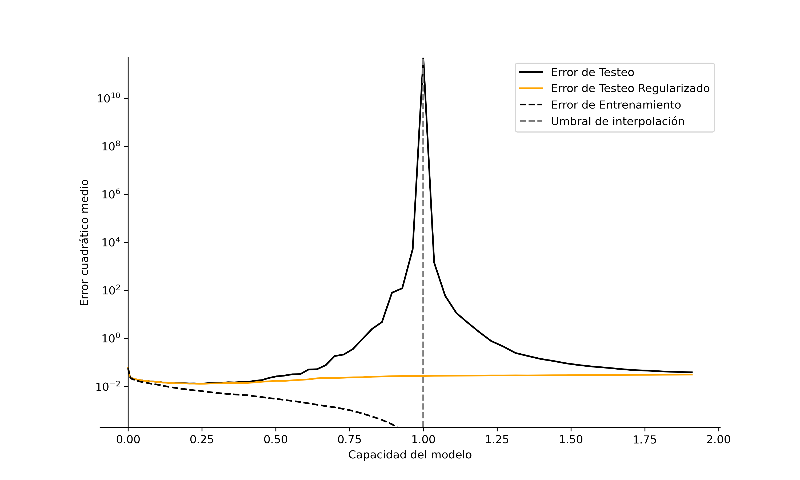
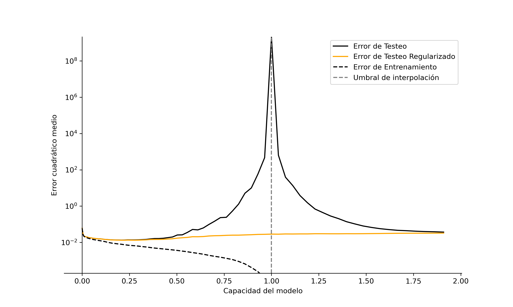

# Regularization Does Away With Double Descent
This is a simple demonstration of how regularization can mitigate the double descent phenomenon in a simple machine learning.

## Poster

## Poster notes
The testing error curve in the hyperparametrized region corresponds to the least L2 norm solution.

The orange curve corresponds to the lambda that minimizes the MSE doing cross-validation.

## Bibliography
### Optimal Regularization Can Mitigate Double Descent
Similar idea applied to a different machine learning problem.

https://arxiv.org/abs/2003.01897

### Neural Redshift: Random Networks are not Random Functions
From here I borrowed the idea of using compressibility as a measure of function complexity.

https://arxiv.org/abs/2403.02241

## L2 vs L1 Regularization
Using L2 or L1 regularization made no difference in the results.

### L1

### L2

